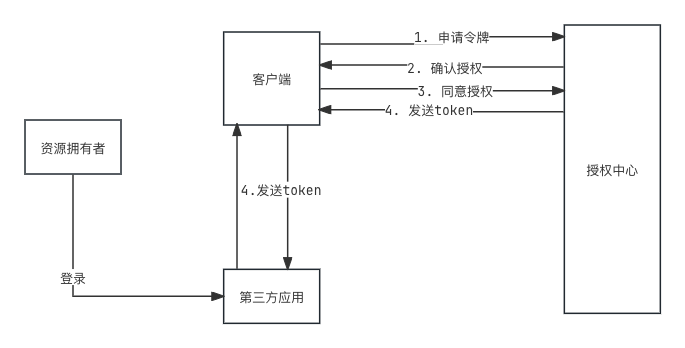

## 1. 什么是OAuth2.0?:question:

>- OAuth2.0是一个开放标准，允许用户授权第三方应用程序访问他们存储在另外一个服务器上的信息，而不再通过用户名和密码进行登录。例如：微信授权中心，登录百度等账号时，可以通过微信授权登录，此时，微信可以访问到我们在百度上的一些信息，校验是否登录成功。
>- OAuth2.0有四种不同的授权方式
>  1. 授权码模式
>  2. 简化模式
>  3. 密码模式
>  4. 客户端模式

### 1.1 OAuth2.0的角色介绍:star:

| 角色       | 说明                                                         |
| ---------- | ------------------------------------------------------------ |
| 客户端     | 本身不存储资源，可以是网站或APP                              |
| 资源拥有者 | 默认为客户                                                   |
| 授权服务器 | 用户服务提供者给资源拥有者的身份进行校验，对访问的资源进行授权等。 |
| 资源服务器 | 存储资源的服务器， 比如：微信存储的用户信息等。              |

>- 以登录知乎为例
>  1. 客户端：即知乎网址
>  2. 资源拥有者：用户本身
>  3. 授权服务器：微信授权中心
>  4. 资源服务器：微信的资源服务器，存储着用户的头像等。
>- 用户通过网址，访问知乎网站，可以通过微信授权登录，微信授权中心校验用户身份后，会返回对应的token，此时访问微信资源服务器时，通过token标识用户已经登录，可以在知乎上，看到自己的微信头像。

### 🔐授权码模式

>1. 授权码模式是最安全的一种类型。缺点：过于复杂
>1. 资源拥有者：用户
>1. 客户端：浏览器/手机APP
>1. 第三方应用：想要登录的地址
>1. 授权中心和资源中心(二者可以是同一个服务器，也可以是不同的服务器)

### 简化模式

>1. 和授权码模式相比，缺少了根据token申请令牌和返回令牌的过程。
