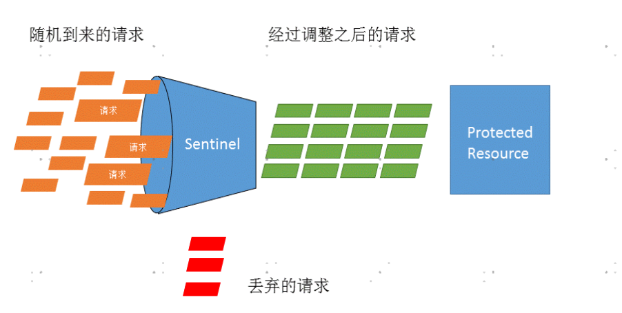
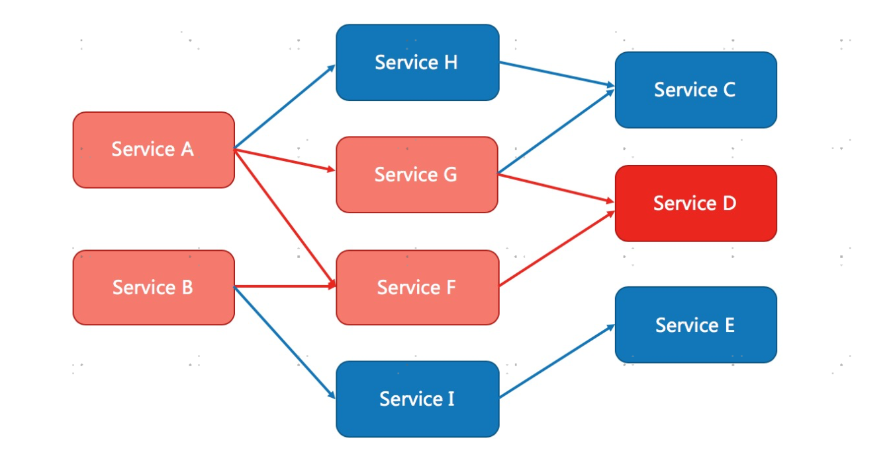

# sentinel

## Sentinel 功能和设计理念

### 流量控制

> 流量控制在网络传输中是一个常用的概念，它用于调整网络包的发送数据。然而，从系统稳定性角度考虑，在处理请求的速度上，也有非常多的讲究。任意时间到来的请求往往是随机不可控的，而系统的处理能力是有限的。我们需要根据系统的处理能力对流量进行控制。Sentinel 作为一个调配器，可以根据需要把随机的请求调整成合适的形状，如下图所示：



流量控制有以下几个角度:

* 资源的调用关系，例如资源的调用链路，资源和资源之间的关系；
* 运行指标，例如 QPS、线程池、系统负载等；
* 控制的效果，例如直接限流、冷启动、排队等。

Sentinel 的设计理念是让您自由选择控制的角度，并进行灵活组合，从而达到想要的效果。

### 熔断

> 除了流量控制以外，及时对调用链路中的不稳定因素进行熔断也是 Sentinel 的使命之一。由于调用关系的复杂性，如果调用链路中的某个资源出现了不稳定，可能会导致请求发生堆积，进而导致级联错误。



## 开始使用

### 单独使用

**引入依赖**

```xml
<dependency>
    <groupId>com.alibaba.csp</groupId>
    <artifactId>sentinel-core</artifactId>
</dependency>
```
