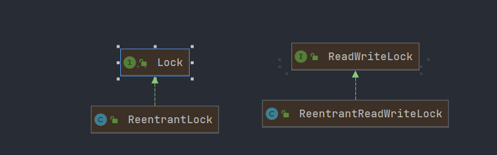

> - 在线文档：https://docs.oracle.com/javase/8/docs/api/?xd_co_f=47c934d9-e663-4eba-819c-b726fc2d0847
> - 

## 1. 基础知识

### 进程和线程

> - 进程：操作系统分配资源的基本单位。一个进程可以包含多个线程。
> - 线程：任务调度和执行的基本单位。

- 线程的状态，可通过 `Thread.State`来查看有哪些状态
  1. NEW
  2. RUNNABLE
  3. BLOCKED
  4. WAITING
  5. TIMED_WAITING
  6. TERMINATED

### 并发和并行

> - 并发：多个线程交替执行，一个CPU同时执行多个线程，线程之间执行过程中进行切换，看起来像同时执行
> - 并行：多个线程同时执行。多核同时执行多个线程和调度任务。
> - 并发编程的本质：**充分利用CPU资源**

- 程序查看有多少核

```java
public class Test01 {

    // 获取CPU核数
    // CPU密集型 IO密集型
    public static void main(String[] args) {
        System.out.println(Runtime.getRuntime().availableProcessors());
    }

}
```

### wait和sleep

### 不同点

1. 来自不同的类。wait来自Object；sleep来自Thread。
2. 锁的释放不同。wait会释放锁；sleep不能释放锁。
3. 使用范围不同。wait必须放到同步代码块中；sleep可以在任何地方使用。
4. 是否可以捕获异常。wait不需要捕获异常；sleep可以捕获异常。

## 2. 锁

### Synchronized和Lock锁的区别

> 1. Synchronized是java内置的关键字，Lock是java的类。
> 2. Synchronized无法获取锁的状态；Lock可以判断是否获取了锁。
> 3. Synchroized不需要释放锁；Lock必须手动释放锁。
> 4. Synchronized 线程一获取锁后，线程二需要一直等待；Lock锁不一定需要继续等待，可设置等待时间
> 5. Synchronized 是非公平锁，不可中断锁，可重入锁；lock可重入锁，可中断锁，默认非公平锁，可设置为公平锁。

### 公平锁和非公平锁

- 公平锁：执行需要根据先后顺序执行
- 非公平锁：执行可以插队

### Synchronized

> - 非公平锁
> - 不可中断锁
> - 可重入锁

> -  应用到实例方法上，是对当前实例对象加锁(this)
> - 应用到代码块中，根据锁定的对象不同，加锁方式不同。
> - 应用到static中，相当于对Class对象加锁。

### 示例方法加锁

````java
 // 打印票的数量
public synchronized void sale() {
	// ... 具体的执行逻辑    
}
````

### 代码块加锁

#### 方式一

````java
  // 打印票的数量
     public void sale() {
         synchronized (Ticket.class) {
             if (number <= 30) {
                 System.out.printf("%s卖出类%d张票，剩余%d张%n", Thread.currentThread().getName(), number++, (total - number));
             }
         }
     }
````

#### 方式二

```java
 // 打印票的数量
    public void sale() {
        synchronized (this) {
            if (number <= 30) {
                System.out.printf("%s卖出类%d张票，剩余%d张%n", Thread.currentThread().getName(), number++, (total - number));
            }
        }
    }
```

### static方法加锁

```java
 // 打印票的数量
public synchronized static void sale() {
	// ... 具体的执行逻辑    
}
```

### Lock

> - 默认为非公平锁，可传入参数到构造器中，制作公平锁
> - 可中断锁
> - 可重入锁



> - Lock是JUC中的接口，有三个实现类，分别为：
>
> 1. ReentrantLock---实现Lock接口
> 2. ReentrantReadWriteLock.ReadLock(读锁)--实现ReadWriteLock接口
> 3. ReentrantReadWriteLock.WriteLock(写锁)--实现ReadWriteLock接口

## 3. 线程池
