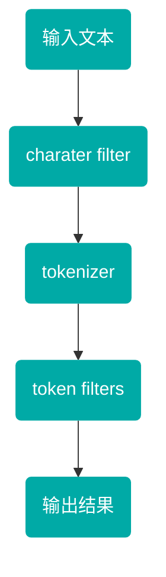

## 什么是分词器❓

> - 顾名思义，文本分析就是 **把全文本转换成一系列单词（term/token）的过程** ，也叫 **分词** 。在 ES 中，Analysis 是通过**分词器（Analyzer）** 来实现的，可使用 ES 内置的分析器或者按需定制化分析器。

### 分词器组成部分

> - 分词器是专门处理分词的组件，分词器由以下三部分组成：
>   1. character filter
>   2. tokenizer
>   3. token filters

#### charater filter

> - 对原字符进行过滤和处理，去除原字符中无效或异常的字符，例如：多余空格等

#### tokenizer

> - 将处理后的字符拆分为一个一个的词，在一个分词器中有且只有一个

#### token filters

> - 对分词结果进行过滤和处理，例如：将多个词合成一个。例如：一个苹果，分成了 [一个，苹果]，则可以通过此过程合成一个词，一个苹果。
> - 一个分词器中可能有多个

### 分词过程

## 常用的分词器

> ES 默认采用采用 `standard` 方式分词

### 内置分词器

### 中文分词器

> - 中文分词器包括 2 种，即 `ik_smart` 和 `ik_max_word`
> - ik 分词器中的简单分词器，支持自定义字典，远程字典
> - ik_分词器的全量分词器，支持自定义字典，远程字典
