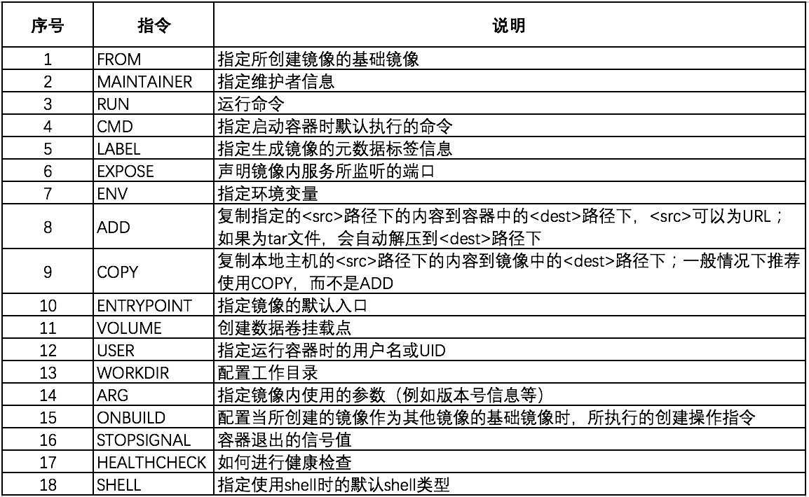

## DockerFile介绍

>DockerFile就是用来构建docker镜像的构建文件

1. 编写DockerFile，`vim DockerFile`

```shell
from mysql:5.7

# 挂载位置，可为空，挂载目录1和2，可以自定义，在容器内也会添加相应的目录，此方式为匿名挂载方式
volumn ['挂载的目录1', '挂载的目录2']

# echo为linux语法，表示在生成后，打印日志
CMD echo "--------end------------"
# 生成后，进入目录中
CMD /bin/bash
```

2. 通过docker build构建

```shell
docker build -f DockerFile文件位置 -t 镜像名:tag名称 镜像位置
```

3. 通过`docker run`运行镜像
4. 通过`docker push`发布镜像，可以发布到私有云或公有云

### 基本命令



## DockerFile构建过程

### 基础知识

>1. 每个保留关键字(指令) 采用大写字母
>2. 执行采用从上到下顺序执行
>3. 使用`#`表示注释
>4. 每个指令都会创建一个新的镜像层并提交
>5. dockerFile是面向开发的，发布项目就需要编写一个dockerfile文件

## DockerFile指令

```shell
FROM       #基础镜像	
MAINTAINER # 镜像维护者，即谁写的镜像
RUN        # 镜像构建时，需要执行的命令
ADD        # 步骤，添加内容，例如：添加jar包等
COPY.      # 将文件拷贝到镜像中
WORKDIR    # 镜像的工作目录
VOLUME		 # 挂载的目录
EXPOST		 # 暴露的端口
CMD				 # 指定容器启动时，要执行的命令，只有最后一个会会生效，可被替代
ENTRYPOINT # 指定容器启动时，要执行的命令，可以追加命令
ENV	       # 构建镜像时，设置环境变量
```

### 实战测试

>- 以centos为例
